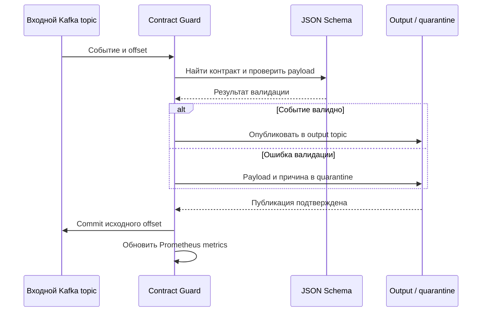

# Контракты событий

Небольшой сервис для команд, обменивающихся JSON-событиями через Kafka. Он валидирует payload во время выполнения, объясняет несовместимые изменения схемы до релиза и отправляет отклонённые сообщения в quarantine, не подтверждая исходный offset раньше времени.

Проект закрывает типичный разрыв ответственности: producer знает модель своего приложения, consumer — требования к аналитике, но между ними часто нет исполняемого соглашения о формате события.

## Возможности

- версионированные JSON Schema-контракты с указанным владельцем;
- валидация через HTTP API, CLI или Kafka worker;
- проверка backward compatibility при удалении полей, добавлении обязательных полей, изменении типов и сужении enum;
- структурированный quarantine envelope вместо общей ошибки;
- Prometheus counters для принятых и отклонённых событий;
- non-root Docker image и небольшой Helm chart с probes и resource limits.



Kafka adapter отключает автоматический commit offset. Сначала он публикует принятую или quarantined запись, ждёт успешного `flush` producer и только затем подтверждает исходное сообщение. Валидация и маршрутизация не зависят от Kafka, поэтому unit-тесты остаются быстрыми.

## Локальный запуск

```bash
python -m venv .venv
source .venv/bin/activate
pip install -e ".[dev]"
uvicorn event_contract_guard.api:app --reload
```

Проверить событие:

```bash
curl -X POST http://localhost:8000/validate/retail.orders.v1 \
  -H "Content-Type: application/json" \
  --data @event.json
```

Проверить новую схему до merge:

```bash
contract-guard retail.orders.v1 candidate-schema.json --schema
```

Другие endpoints: `/compatibility/{subject}`, `/contracts`, `/health` и `/metrics`.

## Развёртывание

```bash
docker compose up --build
helm template contract-guard helm/event-contract-guard
```

Helm chart показывает deployment boundary, но не выдаётся за универсальный platform chart. В рабочей среде контракты следует монтировать из версионированного артефакта или ConfigMap, включить аутентификацию, добавить PodDisruptionBudget и публиковать образ через корпоративный registry.

## Проверки

```bash
pip install -e ".[dev]"
ruff check .
pytest -q
docker compose config --quiet
```

## Ограничения

Compatibility checker обрабатывает небольшой и понятный набор правил верхнего уровня. В JSON Schema значение `default` является аннотацией, поэтому новое обязательное поле считается breaking change даже при наличии default. Для вложенных правил и полноценного governance workflow в production нужен зрелый Schema Registry или стандарт Data Contract Specification.

При проектировании использовались публичные материалы Confluent Schema Registry, Data Contract Specification и модель владения datasets из OpenLineage. Это самостоятельная реализация без копирования исходного кода.
